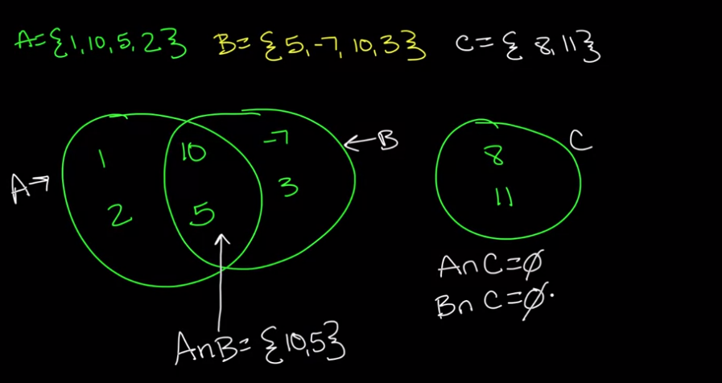
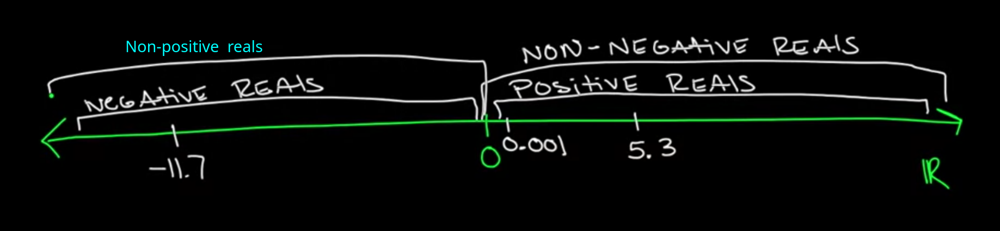

- [Number set](#number-set)
  - [**Natural numbers**](#natural-numbers)
  - [**Integer numbers**](#integer-numbers)
  - [**Rational numbers**](#rational-numbers)
  - [**Irrational numbers**](#irrational-numbers)
  - [Real numbers](#real-numbers)
  - [Complex numbers](#complex-numbers)
- [Basics of arithmetic](#basics-of-arithmetic)
  - [Potenciacion](#potenciacion)
- [Algegra](#algegra)
- [Geometria](#geometria)
  - [Teorema de pitagoras](#teorema-de-pitagoras)
- [Curiosidades](#curiosidades)
  - [Por que no podemos dividir por 0](#por-que-no-podemos-dividir-por-0)
  - [Por que no podemos dividir 0 por 0](#por-que-no-podemos-dividir-0-por-0)
  - [Cuidado con los despejes de raiz cuadrada y potencias de 2](#cuidado-con-los-despejes-de-raiz-cuadrada-y-potencias-de-2)
- [Data science math skills - coursera](#data-science-math-skills---coursera)
  - [Basic vocabulary](#basic-vocabulary)
    - [What is a set?](#what-is-a-set)
      - [Intersection](#intersection)
      - [Union](#union)
    - [Example of medical testing](#example-of-medical-testing)
    - [Sets - Venn Diagrams](#sets---venn-diagrams)
  - [Real numbers](#real-numbers-1)
    - [The real number line](#the-real-number-line)
    - [Less-than and greater-than (inequalities)](#less-than-and-greater-than-inequalities)
    - [Algebra with inequalities](#algebra-with-inequalities)
    - [intervals and intervals notation](#intervals-and-intervals-notation)
  - [Sigma notation - summation](#sigma-notation---summation)
    - [Rules for manipulating sigma notation](#rules-for-manipulating-sigma-notation)
  - [Mean and veriance](#mean-and-veriance)
  - [Cartesian Plane](#cartesian-plane)
    - [Distance on the plane](#distance-on-the-plane)

---

<span style="font-size:4rem;">MATEMÁTICAS</span>

---

# Number set

1. Naturales
2. Enteros
3. Racionales
4. Irracionales
5. Reales
6. Complejos

## **Natural numbers**

---
Son designados por la latre ℕ

Los números naturales son los que desde el principio de los tiempos se han utilizado para contar. En la mayoría de países han adoptado los números arábigos, llamados así porque fueron los árabes quienes los introdujeron en Europa, pero fue en la India donde se inventaron.
El conjunto de los números naturales se denota como `ℕ` y se representan así:

`ℕ = {1, 2, 3, 4, 5, …}`

Los números naturales se caracterizan por dos propiedades:

- El número 1 es el primer número natural y cada número natural se forma sumándole 1 al anterior.
- Cuando restamos o dividimos dos números naturales, el resultado no es necesariamente un número natural.
- En cambio, sí son cerrados respecto a la suma y la multiplicación, es decir, la suma o multiplicación de dos números naturales da siempre como resultado otro número natural.

## **Integer numbers**

Son desigandos con la letra ℤ

Cuando aparece la necesidad de distinguir unos valores de otros a partir de una posición de referencia es cuando aparecen los números negativos. Por ejemplo, cuando desde el nivel 0 (nivel del mar) queremos diferenciar por encima del nivel del mar o por debajo del mar (en las profundidades).

En definitiva, al conjunto formado por los enteros negativos, el número cero y los enteros positivos (o naturales) lo llamamos conjunto de los números enteros.

`ℤ = {… -3, -2,-1, 0, 1, 2, 3, …}`

Los representamos en una recta numérica de la siguiente manera:


Una propiedad importante de los números enteros es que son cerrados respecto a las operaciones de adición, multiplicación y sustracción, es decir, la suma, la resta y la multiplicación de dos números enteros da otro número entero. Nótese que el cociente de dos enteros, por ejemplo 3 y 7, no necesariamente es un entero. Así, la operación división no es cerrada respecto a los números enteros.

## **Rational numbers**

--
Son desigandos con la letra  ℚ

Los números racionales son los números que resultan de la razón (división) entre dos números enteros.

`ℚ= {p/q | p, q ∊ ℤ}`

> racionales = división de p/q donde p y q pertenecen al conjunto de números enteros

`∊` significa perteneciente a.

El resultado de un número racional puede ser un entero o bien un decimal, positivo o negativo. Además, entre los decimales puede ser de dos tipos, con un número limitado de cifras que llamaremos `decimal exacto`, o bien con un número ilimitado de cifras, que llamaremos `decimal periódico`.

Se llaman periódicos porque en la parte decimal hay una o más cifras que se repiten. cuando inmediatamente después de la coma hay una o más cifras repetitivas , los llamamos `periódicos puros` (6.888888…; 6.898989), mientras que en caso contrario los llamamos `periódicos mixtos` (6.12355555…).

Obsérvese que todo entero es un número racional, ya que, por ejemplo, 5= 5/1; por tanto, `ℤ` es un subconjunto de `ℚ`. De la misma manera que los naturales son también enteros, concretamente enteros positivos. Así tenemos que:

`ℕ ⊂ ℤ ⊂ ℚ`

Los números racionales son cerrados, no sólo respecto de las operaciones de adición, multiplicación y sustracción, sino también de la división (excepto por 0).

## **Irrational numbers**

Son desigandos con la letra I

Hemos visto que cualquier número racional se puede expresar como un número entero, un decimal exacto o un decimal periódico. Es decir cualquier número racional se puede escribir como una fracción/cociente/división de dos enteros.

Ahora bien, no todos los números decimales son exactos o periódicos, y por tanto, no todos los números decimales pueden ser expresados como una fracción de dos enteros.

Estos números decimales que no son exactos ni periódicos se caracterizan por tener infinitas cifras decimales no periódicas, es decir, que no se acaban nunca y no tienen un patrón de repetición.

Obsérvese que el conjunto de números irracionales es el complementario del conjunto de números racionales.

Algunos ejemplos de números irracionales son ,, , donde por ejemplo  = 3.1415926535... proviene de la relación entre la longitud de una circunferencia y su diámetro. 

## Real numbers

Son desigandos con la letra R

El conjunto formado por los números racionales y los números irracionales se denomina conjunto de los números reales y se denota como `ℝ`.
Así pues, tenemos que:

`ℝ = ℚ ∪ I`

Tanto los números racionales como los números irracionales son números reales.

Una de las propiedades más importantes de los números reales es poderlos representar por puntos en una línea recta. Se elige un punto llamado origen, para representar el 0, y otro punto, comúnmente a la derecha, para representar el 1.

Resulta así de manera natural una correspondencia entre los puntos de la recta y los números reales, es decir, que cada punto de la recta representa un único número real y a cada número real le corresponde un único punto de la recta. Llamamos a esta recta la recta real.


[Resource](https://www.sangakoo.com/es/temas/conjunto-de-numeros-reales-enteros-racionales-naturales-irracionales)

## Complex numbers

Debido a ecuaciones del tipo  + 

Con lo q en el terreno de los reales no existe un número cuyo cuadrado sea un número negativo.

De ahí q se inventaran los complejos.

Es un número que se expresa como la suma de un número real(ℝ) y un número imaginario (i).

Un número imaginario es aquel <span style="font-size: 1.3rem;color:red">cuyo cuadrado es negativo.</span>

Ejemplo de número complejo:  
>la resta puede ser entendida como la suma con un número negativo

# Basics of arithmetic

## Potenciacion


porque a⁰ = 1

Cuando dividimos potencias el resultado es la resta de sus exponentes si esa resta da 0, por ejemplo: 

2²/ 2² = 4/4 = 1   
2²/ 2² = 2²-² = 2⁰ 

así tenemos que 1 = 2⁰ 

Si queremos operar con potencias con el mismo índice pero base diferente hacemos

2²*3² = (2 * 3)² =36

2² / 3² = (2/3)²

Si tanto la base como el índice son diferentes hacemos:

a² * b³ = (a * b)³ * a²-3

Si dividimos potencias de distinta base, buscamos terminos comunes

4¹² / 2⁸ = (2²)¹² / 2⁸ = 2²⁴ / 2⁸ = 2²⁴-⁸ = 2¹⁶ 

Si no podemos sacar factores comunes

3⁸ / 2² = 3²*⁴ / 2 ² = (3⁴)² / 2² = (3⁴ / 2 )² = (81/2)²


# Algegra

Simbología de conjuntos


> los divisores de un número son aquellos números naturales que lo pueden dividir, resultando de cociente otro número natural y de resto 0. Su división es exacta.
> Div(4)= {1,2,4} // divisores de 4 son 1 2 4
> Cada número tiene una cantidad concreta de divisores. El número 1 tiene sólo un divisor, él mismo.
> Solamente el 0 tiene infinito número de divisores, ya que todos los números son divisores de 0.

# Geometria

## Teorema de pitagoras

El teorema de pitágoras nos dice que en un triángulo rectángulo el cuadrado de la hipotenusa(h) es igual a la suma de los cuadrados de los catetos(c)

+

+

Teniendo esto claro para calcular la distancia entro dos puntos A y B, d(A,B), en el plano cartesiano, siendo:   
A(x1,y1)  
B(x2,y2) 

Sería la raíz cuadrada de la suma de las diferencias de sus coordenadas al cuadrado

=\sqrt[2]{(x_2-x_1)^2})+^2})


La distancia del segmento azul sería x2-x1  
La distancia del segmento verd sería y2-y1

Sería volver a calcular la distancia entre esos puntos pero como podemos ver al restar x2-x1 como están el mismo plano la resta de su y es 0 así q nos qdaría  
 =\sqrt[2]{(x_2-x_1)^2}=x_2-x_1)  
y lo mismo restando y2 - y1 q su X es 0


# Curiosidades

## Por que no podemos dividir por 0

El cociente de una división entre dos números reales, a y b, es un número c que multiplicado por el divisor(b) nos da el dividendo(a)


si dividimos por 0, por ejemplo tenemos


no hay ningún número que multiplicado por 0 nos de el dividendo por eso se dice que la división por 0 <span style="font-size:1.5rem;color:red">no existe</span>

## Por que no podemos dividir 0 por 0

Es el mismo cuento, si tenemos


tenemos infinitos números que multiplicados por 0 dan 0, así que se dice que es <span style="font-size:1.5rem;color:red">indefinido</span>

## Cuidado con los despejes de raiz cuadrada y potencias de 2

>una raíz cuadrada de un número negativo no está definida

cuando tenemos una raíz de un número al cuadrado hay que atender a cómo se resuelve el cuadrado.

Así que el resultado de una raiz cuadrada en el campo de los reales no es +/-, si no q es un númeor +, siempre. Es diferente la raíz cuadrada en el mundo de los números [complejos](#número-complejo). 

Así en los reales la cancelación de la raíz no siempre es directa. 


^{2}}=\Large\sqrt{4}=2)

esto es correcto 

Si cancelo:

^{\cancel2}}=-2)  

<span style="font-size: 1.2rem;color:red">lo que no es verdad</span> xq el cuadrado de un número real siempre es +. Lo correcto sería expresar el resultado de la raíz como el valor absoluto. 

Así^{\cancel2}}\Large=)  y esto sí es correcto.

Expresión gráfica de los valores absolutos, se expresan como la distancia al origen sobre la recta, es decir el 0.


# Data science math skills - coursera

Link to [Data science math skills course](https://www.coursera.org/learn/datasciencemathskills/home/welcome)

## Basic vocabulary

### What is a set?

`A = {1, 2, -3, 7}`  

`B = {apple,monkey, David}`

A set is a collection of things. A set is made up of elements, to indicate if a element is in a set we can write:

- `2 ∊ A` it means 2 is an element of A 
-  8 is not in A

Sets has `cardinality`, the cardinality of A is the number of elements in it, we can write cardinality as:
-  `|A| = 4`

If we have this three sets:  
`A= {1,2,-3,7} `  
`B= {2,8,-3,10} `  
`C= {5,10} `  

#### Intersection

we can say that there are elements that appear in more than one set, we can diffine a new set using intersection simbol:

- 
- 
-  (the empty set so cardinality | | =0)

so we can write it as a general expression as:

-   
- a resulted set of intersection between a and b is a number x:(the semicolon means x must follow next condition) is in both sets A and B.

#### Union


- 

so:

- 

### Example of medical testing

we have a syndrome called VBS (very bad syndrome) and we want to make a clinical trial.

- VBS = very bad syndrome 
- Z = set of people in a clinical trial 
- 
 

- 

so:

-  (union)

-  (intersection)

we can define two new sets according to test results:

- 

- 

so: 

-  (union)

-  (intersection)

In a ideal world `S = P` and `H = N` but we have 4 situation:

- (True positives )
- (True negatives)
- (False negative)
- (false Positive)

The intereting thing is comaparing the cardinalities of these 4 sets :

1. |S| / |X| = proportion of people in the study who has VBS
2. |H| / |X| = proportion of people in the study without VBS
3.  = true positive rate, idealy would be near to 1  
4.  = False positive rate, idealy would be near to 0  
5.  = False negative rate, idealy would be near to 0  
6.  = True negative rate, idealy would be near to 1

### Sets - Venn Diagrams



inclusion-exclusion Formula: 

 +   


## Real numbers

### The real number line

An explanation of what a real number is -> [**Números reales ℝ**](#real-numbers)

A things that mathematicians often do is compartmentalize big sets into smaller sets and give different categories for whats are.

So the first big division of the real numbers is into negatives and positives.



- non-negative reals is when it inclued zero into positive reals.  
- non-positive reals is when it inclued zero into negative reals.


so we can write a general rule for any 

this is what's called a definition by cases  


### Less-than and greater-than (inequalities)

  

if and only if <=>

In data science we can found this symbol x >> y, it means x is much much greater than y. It is not a math concepts but very common on Data science.  

### Algebra with inequalities 

A quick refresh of algebra with equalities 

  


if we use inequalities  

  


multiplying inequalities in both sides it's a little more dangerous because when we multiply by a negative number.


### intervals and intervals notation 

1. closed interval 


2. open interval 


3. half open intervals 


4. Ray


so we can make some algebra with inequalities and intervals

when we get an expression like 1 <= x+5 < 10 it cannot be a single value for X intead,  it will have an interval as a result


## Sigma notation - summation


Sigma means a sum, starting in a given number (i = 1) to a specific number (4) and applying these values to the algebraic expression.

In our first example it would be :


i = 1 -> 1² = 1  
i = 2 -> 2² = 4   
i = 3 -> 3² = 9   
i = 4 -> 4² = 16  


### Rules for manipulating sigma notation 

1. Distributive property in sigma notation 

Whenever you have an expression with a constant inside the sigma you can pull it outside and just then evaluate it. It works because a mathematic property called distribution 


2. fragmentation


3. sum of a constant

it means the result will be n times the constant

 


## Mean and veriance 

if we have a set of numbers   


1. we can describe mean or average as :

)


is important to know a concept very useful in data science called `mean-centering`. We have a data set (Z) and we transform it into another data set which sort of has the same relationships but the mean is 0.


2. variance of x :

Variance gives us a sort of how spread out is our data

^2\large\])

the terms ) it gives us a sort of how far are you from the mean. So the variance is the mean of how far is each value from the mean.


3. the standard deviation:


## Cartesian Plane

Cartesian plane or R² is made by two axis, X and Y 

We define:

 - X axis = {(x,y) € R²:y=0} , X axis is the set of all points (x,y) in the cartesian plane (R²) such that y = 0. 
 
 - Y axis = {(x,y) € R²:x=0} , Y axis is the set of all points (x,y) in the cartesian plane (R²) such that x = 0. 


These two axis define 4 quadrants:
 - First quadrant -> ((x,y) € R²: x>0, y>0)
 - Second quadrant-> ((x,y) € R²: x<0, y>0)
 - Third quadrant -> ((x,y) € R²: x<0, y<0)
 - Fourth quadrant-> ((x,y) € R²: x>0, y<0)

### Distance on the plane

- The distance formula
- Nearest neighbors
- clustering

1. The distance formula

To determinate the distance between two points on a plane we must use the [Teorema de pitagoras](#teorema-de-pitagoras), which says h² = c²+c² 

2. closer neighbors 

If we have diferents points on a plane we can get the distance between them and one specific point, for instance point A. That gives us a set of a distance from point A to the others.
```
s= {O,B,D}
```

