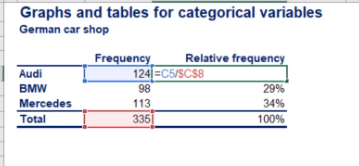

- [Conjunto de números](#conjunto-de-números)
  - [**Números naturales ℕ**](#números-naturales-ℕ)
  - [**Números enteros ℤ**](#números-enteros-ℤ)
  - [**Números racionales ℚ**](#números-racionales-ℚ)
  - [**Números irracionales I**](#números-irracionales-i)
  - [**Números reales ℝ**](#números-reales-ℝ)
  - [Número complejo](#número-complejo)
- [Álgegra](#álgegra)
- [Geometría](#geometría)
  - [Teorema de pitágoras](#teorema-de-pitágoras)
- [Estadísica](#estadísica)
  - [Population vs sample](#population-vs-sample)
  - [Datos](#datos)
  - [Visualización de los datos Categóricos](#visualización-de-los-datos-categóricos)
  - [Visualización de los datos Numéricos](#visualización-de-los-datos-numéricos)
- [Curiosidades](#curiosidades)
  - [Por qué no podemos dividir por 0](#por-qué-no-podemos-dividir-por-0)
  - [Por qué no podemos dividir 0 por 0](#por-qué-no-podemos-dividir-0-por-0)
  - [Cuidado con los despejes de raiz cuadrada y potencias de 2](#cuidado-con-los-despejes-de-raiz-cuadrada-y-potencias-de-2)

---

MATEMÁTICAS

---

# Conjunto de números

1. Naturales
2. Enteros
3. Racionales
4. Irracionales

## **Números naturales ℕ**

---

Los números naturales son los que desde el principio de los tiempos se han utilizado para contar. En la mayoría de países han adoptado los números arábigos, llamados así porque fueron los árabes quienes los introdujeron en Europa, pero fue en la India donde se inventaron.
El conjunto de los números naturales se denota como `ℕ` y se representan así:

`ℕ = {1, 2, 3, 4, 5, …}`

Los números naturales se caracterizan por dos propiedades:

- El número 1 es el primer número natural y cada número natural se forma sumándole 1 al anterior.
- Cuando restamos o dividimos dos números naturales, el resultado no es necesariamente un número natural.
- En cambio, sí son cerrados respecto a la suma y la multiplicación, es decir, la suma o multiplicación de dos números naturales da siempre como resultado otro número natural.

## **Números enteros ℤ**

Cuando aparece la necesidad de distinguir unos valores de otros a partir de una posición de referencia es cuando aparecen los números negativos. Por ejemplo, cuando desde el nivel 0 (nivel del mar) queremos diferenciar por encima del nivel del mar o por debajo del mar (en las profundidades).

En definitiva, al conjunto formado por los enteros negativos, el número cero y los enteros positivos (o naturales) lo llamamos conjunto de los números enteros.

`ℤ = {… -3, -2,-1, 0, 1, 2, 3, …}`

Los representamos en una recta numérica de la siguiente manera:

Una propiedad importante de los números enteros es que son cerrados respecto a las operaciones de adición, multiplicación y sustracción, es decir, la suma, la resta y la multiplicación de dos números enteros da otro número entero. Nótese que el cociente de dos enteros, por ejemplo 3 y 7, no necesariamente es un entero. Así, la operación división no es cerrada respecto a los números enteros.

## **Números racionales ℚ**

--

Los números racionales son los números que resultan de la razón (división) entre dos números enteros.

`ℚ= {p/q | p, q ∊ ℤ}`

> racionales = división de p/q donde p y q pertenecen al conjunto de números enteros

`∊` significa perteneciente a.

El resultado de un número racional puede ser un entero o bien un decimal, positivo o negativo. Además, entre los decimales puede ser de dos tipos, con un número limitado de cifras que llamaremos `decimal exacto`, o bien con un número ilimitado de cifras, que llamaremos `decimal periódico`.

Se llaman periódicos porque en la parte decimal hay una o más cifras que se repiten. Si justo los números que se repiten comienzan a las décimas, los llamamos `periódicos puros` (6.888888…), mientras que en caso contrario los llamamos `periódicos mixtos` (6.12355555…).

Obsérvese que todo entero es un número racional, ya que, por ejemplo, 5= 5/1; por tanto, `ℤ` es un subconjunto de `ℚ`. De la misma manera que los naturales son también enteros, concretamente enteros positivos. Así tenemos que:

`ℕ ⊂ ℤ ⊂ ℚ`

Los números racionales son cerrados, no sólo respecto de las operaciones de adición, multiplicación y sustracción, sino también de la división (excepto por 0).

## **Números irracionales I**

Hemos visto que cualquier número racional se puede expresar como un número entero, un decimal exacto o un decimal periódico. Es decir cualquier número racional se puede escribir como una fracción/cociente/división de dos enteros.

Ahora bien, no todos los números decimales son exactos o periódicos, y por tanto, no todos los números decimales pueden ser expresados como una fracción de dos enteros.

Estos números decimales que no son exactos ni periódicos se caracterizan por tener infinitas cifras decimales no periódicas, es decir, que no se acaban nunca y no tienen un patrón de repetición.

Obsérvese que el conjunto de números irracionales es el complementario del conjunto de números racionales.

Algunos ejemplos de números irracionales son ,, , donde por ejemplo  = 3.1415926535... proviene de la relación entre la longitud de una circunferencia y su diámetro. 

## **Números reales ℝ**

El conjunto formado por los números racionales y los números irracionales se denomina conjunto de los números reales y se denota como `ℝ`.
Así pues, tenemos que:

`ℝ = ℚ ∪ I`

Tanto los números racionales como los números irracionales son números reales.

Una de las propiedades más importantes de los números reales es poderlos representar por puntos en una línea recta. Se elige un punto llamado origen, para representar el 0, y otro punto, comúnmente a la derecha, para representar el 1.

Resulta así de manera natural una correspondencia entre los puntos de la recta y los números reales, es decir, que cada punto de la recta representa un único número real y a cada número real le corresponde un único punto de la recta. Llamamos a esta recta la recta real.

[Resource](https://www.sangakoo.com/es/temas/conjunto-de-numeros-reales-enteros-racionales-naturales-irracionales)

## Número complejo

Debido a ecuaciones del tipo  + 

Con lo q en el terreno de los reales no existe un número cuyo cuadrado sea un número negativo.

De ahí q se inventaran los complejos.

Es un número que se expresa como la suma de un número real(ℝ) y un número imaginario (i).

Un número imaginario es aquel cuyo cuadrado es negativo.

Ejemplo de número complejo:  
>la resta puede ser entendida como la suma con un número negativo

# Álgegra

Simbología de conjuntos

> los divisores de un número son aquellos números naturales que lo pueden dividir, resultando de cociente otro número natural y de resto 0. Su división es exacta.
> Div(4)= {1,2,4} // divisores de 4 son 1 2 4
> Cada número tiene una cantidad concreta de divisores. El número 1 tiene sólo un divisor, él mismo.
> Solamente el 0 tiene infinito número de divisores, ya que todos los números son divisores de 0.

# Geometría

## Teorema de pitágoras

El teorema de pitágoras nos dice que en un triángulo rectángulo el cuadrado de la hipotenusa(h) es igual a la suma de los cuadrados de los catetos(c)

+

+

Teniendo esto claro para calcular la distancia entro dos puntos A y B, d(A,B), en el plano cartesiano, siendo:   
A(x1,y1)  
B(x2,y2) 

Sería la raíz cuadrada de la suma de las diferencias de sus coordenadas al cuadrado

=\sqrt[2]{(x_2-x_1)^2+(y_2-y_1)^2})

La distancia del segmento azul sería x2-x1  
La distancia del segmento verd sería y2-y1

Sería volver a calcular la distancia entre esos puntos pero como podemos ver al restar x2-x1 como están el mismo plano la resta de su y es 0 así q nos qdaría  
 =\sqrt[2]{(x_2-x_1)^2}=x_2-x_1)  
y lo mismo restando y2 - y1 q su X es 0

# Estadísica

## Population vs sample

**Population** es la colección de todos los items de interés y está representado por la letra `N` y lo número que obtenemos de esa población 
son los  `parámetros`.

**sample/muestra** es un subgrupo dentro de la población representado por una `n ` y los valores que obtenemos cuando trabajamos con 
la muestra es lo que llamamos `estadísticas`

Según estas difiniciones la población es difícil de efinir y de obserar en el mundo real por eso se usa una muestra de la población a 
estudio. 

La muestra debe ser:

1. aleatoria      -> todos los miembros que forman parte de la población tienen la misma probabilidad de ser escogidos para formar parte de la muestra
2. representativo -> es que la muestra debe refleja todos los miembros de la población a estudio

## Datos

Los datos los podemos clasificar según son:

1. Tipos de datos
   1. Datos categóricos -> describe grupos/categorias normalmente la respuesta a la pregunta es sí/no (grupo de estudiantes que tienen coche propio)
   2. Datos numéricos
      1. Discretos -> los valores que los representan son valores enteros (cuantos hijos tienen las familias USA o el dinero)
      2. Continuos -> son valores infinitos e impossibles de medir. El peso de un individuo, en primer lugar podemos aumentar o disminuir la precisión (tantos digitos como decimales), 
                      el valor nunca es estable va variando en pequeñas cantidades (cada gota de sudor cambia tu peso) por eso decimos que son continuos. También son continuos la altura, el área, distancias y tiempo 

2. Nivel de medida - cómo se miden
   1. cualitativos
      1. Nominal -> definen las categorias por ejmplo diferentes marcas de autos (audio,bmw,...) No son números y no pueden ser ordenados
      2. Ordinal -> son grupos o categorias que siguen un estricto orden, por ejemplo categorizar las comidas éstas puedes ser desagradables-no apetitosas-neutras-sabrosas-diliciosas 
                    no son números pero se pueden ordenar de en una escala de negativo a positivo (este sistema de medida es cualitativo)
   
   2. cuantitativos
      1. Intervales
      2. Ratios
      Ambos son representados por números pero la principal diferencia es que los `ratios` tienen un verdadero 0 mientras que los intervalos no!

## Visualización de los datos Categóricos

Podemos organizar los datos en una tabla de frecuencias, sería como recopilar los datos absolutos. Esos datos los podemos pintar en un esquema de barras. Si queremos dibujaros en un deagrama circular debemos obtener la frecuencia relativa
de cada valor (porcentaje respecto del total)

Las frecuencias relativas las podemos expresar en un pie chart

Tenemos un tipo especial de diagrama el `Pareto diagram `  es como un diagrama de barras pero las categorias se muestran ordenadas en orden descendiente
según sus frecuencias añaiendo una curva que representa la frecuencia acumulativa ésto es, una vez ordenadas las categorias, sumamos la frecuencia relativa de cada categoria 
hasta llegar al 100 %.

La curva se lee con el eje de la izquierda

El diagrama de pareto nos muestra como los subtotales van cambiando con cada categoria adicional y nos da una mejor comprensión de nuestros datos.

Pareto a parte de invenar ese diagrama tb inventó la regla de pareto que decía `el 80 % de los efectos pueden ser explicados por el 20 % de las causas` por ejemplo microsoft arreglo el 20 % de sus bugs o que solucionó el 80 % de los problemas de sus usuarios

La frecuencia es el número que parece cada item (por ejemplo el número de unidades vendidas de un modelo concreto respecto el total de ventas)

## Visualización de los datos Numéricos

# Curiosidades

## Por qué no podemos dividir por 0

El cociente de una división entre dos números reales, a y b, es un número c que multiplicado por el divisor(b) nos da el dividendo(a)

si dividimos por 0, por ejemplo tenemos

no hay ningún número que multiplicado por 0 nos de el dividendo por eso se dice que la división por 0 no existe

## Por qué no podemos dividir 0 por 0

Es el mismo cuento, si tenemos

tenemos infinitos números que multiplicados por 0 dan 0, así que se dice que es indefinido

## Cuidado con los despejes de raiz cuadrada y potencias de 2

>una raíz cuadrada de un número negativo no está definida

cuando tenemos una raíz de un número al cuadrado hay que atender a cómo se resuelve el cuadrado.

Así que el resultado de una raiz cuadrada en el campo de los reales no es +/-, si no q es un númeor +, siempre. Es diferente la raíz cuadrada en el mundo de los números [complejos](#número-complejo). 

Así en los reales la cancelación de la raíz no siempre es directa. 

^{2}}=\Large\sqrt{4}=2)

esto es correcto 

Si cancelo:

^{\cancel2}}=-2)  

lo que no es verdad xq el cuadrado de un número real siempre es +. Lo correcto sería expresar el resultado de la raíz como el valor absoluto. 

Así^{\cancel2}}\Large=)  y esto sí es correcto.

Expresión gráfica de los valores absolutos, se expresan como la distancia al origen sobre la recta, es decir el 0.

