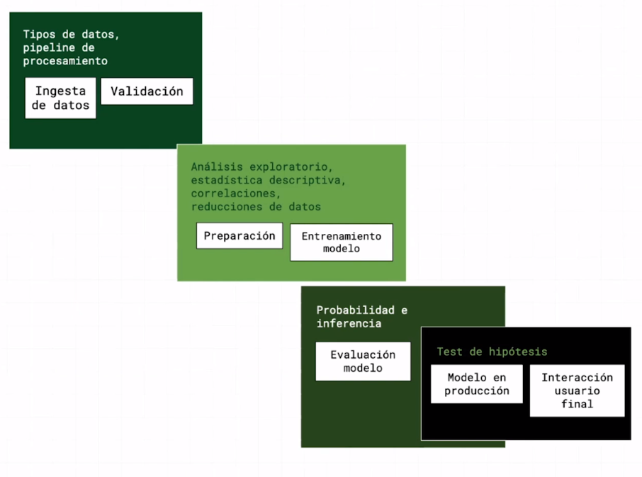

<style>
p{
   font-size: 15px;
}

</style>

# Estadísica

## Estadística descriptiva vs estadística inferencial

<p>
eflñewlmñwelmew

</p>
Son las dos ramas principales de la estadística.
Tomemos como ejemplo un jugador de fútbol, durante su carrera deportiva éste va generando diferentes datos como minutos jugados, goles marcados, lesiones, etc todos esos datos los resumimos en estadísticas, gráficos para que podamos sacar la info de manera más sencilla. Ese tipo de estadística es la descriptiva, resumir información.

Ahora, a partir de esos datos podemos extraer un juicio o conclusión, es decir inferir un hecho. La estadística inferencial se basa en intentar predecir el furuto a partir de los datos obtenidos. 

## Flujo de trabajo en ciencia de datos


Según este flujo vamos a identificar dónde se aplica estadística.



1. Preprocesamiento (ingesta de datos y validación) 

Se usa la descriptiva.
Tenemos que identificar en un dataset cuales son los tipos de datos y cual será el flujo de procesamiento. Este flujo de procesamiento va a definir cuales son las transformaciones que tenemos que hacer sobre los datos para dejarlos limpios y adaptadlos a lo que necesita el modelo que se va a necesitar para resolver un problema puntual.

2. Preparación y entrenamiento del modelo

Se usa la descriptiva.
<p id="par"> Es la fase entre termino de procesar los datos y empiezo a construir el modelo. En este punto hay que hacer un análisi exploratorio de los datos utilizando estadística descriptiva, entender si hay correlaciópn entre los datos y en base a eso poder hacer posibles reducciones de los datos.</p>

3. Evaluación del modelo, enviar modelo a producción e interacción del modelo con el user final

En este punto la estadística q interviene es la probabilidad y la inferencia., para ello se puede usar el test de hipótesis.

## Population vs sample

**Population** es la colección de todos los items de interés y está representado por la letra `N` y lo número que obtenemos de esa población 
son los  `parámetros`.

**sample/muestra** es un subgrupo dentro de la población representado por una `n ` y los valores que obtenemos cuando trabajamos con 
la muestra es lo que llamamos `estadísticas`

Según estas difiniciones la población es difícil de efinir y de obserar en el mundo real por eso se usa una muestra de la población a 
estudio. 

La muestra debe ser:

1. aleatoria      -> todos los miembros que forman parte de la población tienen la misma probabilidad de ser escogidos para formar parte de la muestra
2. representativo -> es que la muestra debe refleja todos los miembros de la población a estudio

## Datos

Los datos los podemos clasificar según son:

1. Tipos de datos
   1. Datos categóricos -> describe grupos/categorias normalmente la respuesta a la pregunta es sí/no (grupo de estudiantes que tienen coche propio)
   2. Datos numéricos
      1. Discretos -> los valores que los representan son valores enteros (cuantos hijos tienen las familias USA o el dinero)
      2. Continuos -> son valores infinitos e impossibles de medir. El peso de un individuo, en primer lugar podemos aumentar o disminuir la precisión (tantos digitos como decimales), 
                      el valor nunca es estable va variando en pequeñas cantidades (cada gota de sudor cambia tu peso) por eso decimos que son continuos. También son continuos la altura, el área, distancias y tiempo 

2. Nivel de medida - cómo se miden
   1. cualitativos
      1. Nominal -> definen las categorias por ejmplo diferentes marcas de autos (audio,bmw,...) No son números y no pueden ser ordenados
      2. Ordinal -> son grupos o categorias que siguen un estricto orden, por ejemplo categorizar las comidas éstas puedes ser desagradables-no apetitosas-neutras-sabrosas-diliciosas 
                    no son números pero se pueden ordenar de en una escala de negativo a positivo (este sistema de medida es cualitativo)
   
   2. cuantitativos
      1. Intervales
      2. Ratios
      Ambos son representados por números pero la principal diferencia es que los `ratios` tienen un verdadero 0 mientras que los intervalos no!


## Visualización de los datos

Podemos visualizar datos usando la libreria pandas de python. Si tenemos un archivo csv podemos cargar los datos en forma de tabla

```python
import pandas as pd
df = pd.read_csv('../../datos/cars.csv')
df 
```
Si queremos saber el tipo de datos que estamos manejando 

```python
df.dtypes
```
esto nos arroja por cada campo de la tabla su tipo  


podemos tenerlo solo los tipos de datos diferentes para que no haya repeticiones 

```python
my_set = set(df.dtypes)
my_set
'''
{dtype('bool'), dtype('int64'), dtype('float64'), dtype('O')}
'''
```
cuando el resultado es dtypoe('O') es un object.

objetos y bool => datos de tipo categórico 
int64(discreto) float64(continuo) => datos de tipo numérico 

De todos los datos que tenemos en el dataframe podemos geenrar toda una estadística descriptiva de aquellos datos del tipo numérico gracias a la función `describe()`de pandas

```python
df.describe()
```


### Categóricos

Podemos organizar los datos en una tabla de frecuencias, sería como recopilar los datos absolutos. Esos datos los podemos pintar en un esquema de barras. Si queremos dibujaros en un deagrama circular debemos obtener la frecuencia relativa
de cada valor (porcentaje respecto del total)


Las frecuencias relativas las podemos expresar en un pie chart


Tenemos un tipo especial de diagrama el `Pareto diagram `  es como un diagrama de barras pero las categorias se muestran ordenadas en orden descendiente
según sus frecuencias añaiendo una curva que representa la frecuencia acumulativa ésto es, una vez ordenadas las categorias, sumamos la frecuencia relativa de cada categoria 
hasta llegar al 100 %.


La curva se lee con el eje de la izquierda

El diagrama de pareto nos muestra como los subtotales van cambiando con cada categoria adicional y nos da una mejor comprensión de nuestros datos.


Pareto a parte de invenar ese diagrama tb inventó la regla de pareto que decía `el 80 % de los efectos pueden ser explicados por el 20 % de las causas` por ejemplo microsoft arreglo el 20 % de sus bugs o que solucionó el 80 % de los problemas de sus usuarios

La frecuencia es el número que parece cada item (por ejemplo el número de unidades vendidas de un modelo concreto respecto el total de ventas)

## Visualización de los datos Numéricos


