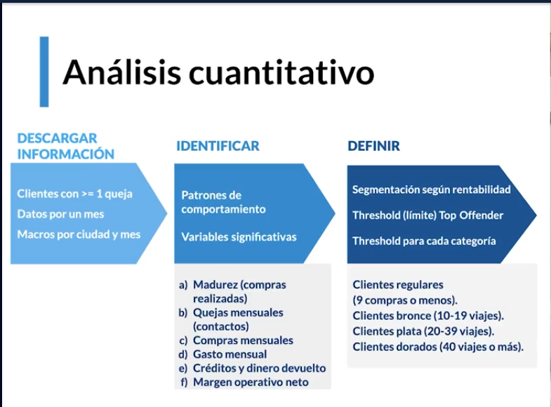

# Ciencia de dato y Big Data

## Definición

Big data básicamente es la recopilación de una gran cantidad de datos( se habla de a partir de 1 millón de registros) y mediante estudios estadísticos/matemáticos sacar na conclusión/solución para un problema de negocio.

## Tipos de datos

### Genrados por personas

Son los datos que se generán con la actividad de los usuarios, por ejemplo dar un like en una imagen. De esa acción se extrae datos como que tipo de imagenes nos gustan, cuanto tiempo pasamos mirando el contenido de cierto usuario,...

### Transacciones

Hay de dos tipos:

1. Monetarias

Por ejemplo cuando realizamos un pago electrónico genera una guella digital que contiene información como la cantidad, el establecimiento donde lo realizamos,...

2. No monetarias

Por ejemplo compañías telefónicas, éstas pueden medir nuestra actividad cada cuanto llamamos, el consumo de datos que hacemos, etc...

### Navegación web

Las famosas cookies, éstas recolectan información sobre nuestra actividad al navegar x internet. Si nos conectamos a una web pueden saber desde dnd lo hacemos, que edad tenemos, sexo, ...

### MAchine 2 Machine

Conexión entre máquinas, por ejemplo la localización móvil. Maps usa esta comunicación entre distintos terminales que ofrecen su localización para ofrecerte el taxi más cercano.

### Biométricos

Te identifican como ser único, por ejemplo angre, saliva o huella dactilar.

## Crear culltura de datos en la empresa | empresa data-driven

Son empresas que toman cisiones en base a hipotesis que son validadas por datos, es decir se plantea una pregunta y si los datos las respaldan se tomo una acción. los pasos básicos serían:

1. Recolectar información
2. Medir esos datos
3. Tomar datos relevantes y precisos
4. Crear hipótesis y contrastarla/testearla con los datos
5. A partir de los insights, resultado del análisis de los datos, generar una acción
6. Cumplir las regulaciones de datos, ética de los datos, no tomar datos sesgados por edad o por sexo...
7. Automatizar el estudio, se realiza una vez y se puede aplicar en el momento deseado.

# Inteligencia artificial y machine learning (aprendizaje automatizado)

## Definiciones

**inteligencia artificial(AI)** con la contrucción de IBM de deep Blue, la computadora que jugaba a ajedrez, ésta utilizaba un algoritmo que le permitia replicar movimientos del jugador humano y poderse anticipar a sus movimientos.

**Machine learning**, es la capacidad de que las máquinas aprendan mediante la experiencia sin que estén previamente programadas para ello

**Deep learning**, son algoritmos capaces de gestionar y relacionar entre sí gran cantidad de datos imitando las redes neutronales.

## Machine learning

Aprendizaje automatizado, replica los movimientos y los perfecciona.

Sirve principalmente para:

- detectar fraudes
- búsqueda en a web
- anuncios a tiempo real
- análisis de textos/info
- next best action, son algoritmos que sabiendo lo que está haciendo el cliente se le propone nuevas acciones que le pueden interesar (por ejm en una plataforma bancaria sugieren a gente con un perfil concreto ciertos productos como hipotecas)

## Deep learning

El deep learning es un tipo de machine learning que entrena a una computadora para que realice tareas como las hacemos los seres humanos, como el reconocimiento del habla, la identificación de imágenes o hacer predicciones.

Los diferentes datos que pueden procesar son imagenes, sonidos y videos.

## Flujo de trabajo en ciencia de datos

Roles en datos:

1. Ingeniero/arquitecto de datos => es el que extrae los datos del dispositivo y crea la bbdd, básicamente trabajan creando APIs/ETLs

   ETL por sus siglas en inglés (Extract, Transform, Load) representa extracción, transformación y carga. Básicamente consiste en “Extraer” los datos crudos desde su origen (Source), “Transformarlos” según nuestras necesidades de analítica o la estructura que deseamos y “Cargarlos” a una base de datos orientada a procesos analíticos (Target).

   Extract, Transform and Load («extraer, transformar y cargar», frecuentemente abreviado ETL) es el proceso que permite a las organizaciones mover datos desde múltiples fuentes, reformatearlos y limpiarlos, y cargarlos en otra base de datos, data mart, o data warehouse para analizar, o en otro sistema operacional para apoyar un proceso de negocio.

2. Analista / business intelligence (BI) => partiendo de los datos creados por el ingeniero de datos va a leerlos para crear cuadros de control y monitorear esos datos, tb automatizará este
   procedimientos. Usan principalmente exccel y sql. Conoce el pasado y el presente del negocio

3. Data scientist => Es parecido al analista pero es capaz de con los datos predecir que sucederá mediante modelos estadísticos. Lo más usado es R y python.

4. Data translator => sería el rol lider del equipo, es aquella persona que entiende las necesidades del negocio y mediante lo info generada por los otros 3 niveles interpretarlo y obtener un beneficio.

## Herramientas para cada etapa del análisis de datos

1. extracción de info con SQL
2. análisis y visualización con R y python

## Análisis cuantitativo

treshold => límite
